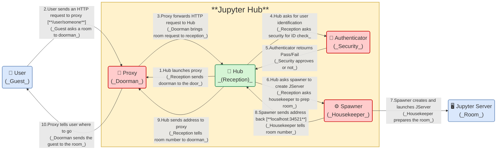
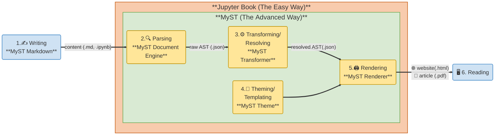

In my second month as a JupyterHub and Jupyter Book Community Manager, I spent time diving deeper into both projects to better understand how they work and how I can best support the people behind them. 
Along the way, I played around with [Mermaid](https://mermaid.ai/open-source/) diagrams—which integrate nicely with MyST Markdown—to organize what I was learning, and you will find two examples in this post.
This month also included my first Jupyter Book release and participation in the 3{sup}`rd` ORMIR Workshop.

## Understanding JupyterHub

[JupyterHub](https://jupyterhub.readthedocs.io/) is a collection of tools that provides standardized, user-friendly computing environments for education and research. 
Instead of spending time configuring servers and dependencies, students and researchers can simply click a button, log in, and start computing within seconds. 

To learn how JupyterHub works, the [conceptual overview](https://jupyterhub.readthedocs.io/en/stable/explanation/concepts.html) in the documentation is a great starting point.
However, since I am not an expert in servers or back-end systems, I needed an analogy to help me get started. 
With the help of a large language model, I realized that the service provided by JupyterHub is not that different from the service at a fancy hotel! 

Imagine a **user** as a hotel guest and a **Jupyter Server** as the guest's room. 
JupyterHub's job is to get each user to their own server, just as a hotel gets each guest to the correct room.
To do so, JupyterHub relies on four main components: the **Hub** (the reception), the **Proxy** (the doorman), the **Authenticator** (security) and the **Spawner** (the housekeeper). 

The Hub starts the Proxy (the reception tells the doorman to take his position at the front door; step **1** in the Figure above).
The user then sends an HTTP request to the Proxy (the guest arrives and asks the doorman for a room; **2**),
and the Proxy forwards the request to the the Hub (the doorman brings the request to the reception; **3**).

The Hub asks the Authenticator to verify the user's identity (the receptionist asks security to check the guest's ID; **4**). 
Once the user (guest) is authenticated (**5**), the Hub asks the Spawner to prepare a Jupyter Server (the receptionist asks the housekeeper to prepare the room; **6**). 
The Spawner then configures the Jupyter Server (the housekeeper gets the room ready; **7**).

When the server (room) is ready, the Spawner returns its address (the housekeeper reports the room number; **8**). 
The Hub passes this information to the Proxy (the receptionist tells the doorman which room to use; **9**), 
and finally, the Proxy redirects the user to their server so that she can start working (the doorman shows the guest to her room; **10**).

In reality, the **interactions are more complex** because the Proxy and the Jupyter Servers are often already running.
However, this **simplification** helped me build a **first mental model** that I hope to refine in the coming months. 
I also hope that it **helps others** who are trying to learn more about JupyterHub.
And if you're a JupyterHub expert, I'd love to hear your feedback, references, or suggestions so we can continue improving and enriching this understanding!

## Understanding Jupyter Book and MyST

There is an ongoing conversation about what Jupyter Book and MyST are, how they differ, and whether they should become one single tool or remain two separate ones. 
To find some answers, I spent quite a bit of time digging into the official documentation, discussing the topic with maintainers and contributors, and observing users learn these tools. Here is my understanding so far.

Both the [Jupyter Book documentation](https://jupyterbook.org/community/ecosystem/#whats-different-between-jupyter-book-and-the-myst-document-engine) 
and 
[MyST documentation](https://mystmd.org/guide/contribute-docs#jb-vs-md) 
include sections explaining the differences between the two tools. In a nutshell: 
- **Jupyter Book** is a tool for creating books, guidelines, and code documentation, primarily as **multi-page websites**. In version 1, Jupyter Book was built on top of [Sphinx](https://www.sphinx-doc.org/), a documentation generator used mainly for Python projects. In the current version 2, Jupyter Book is built on top of MyST.
- **MyST** is a more general publishing tool that is **agnostic to the final output format**. It can be used to create single-page documents, multi-page websites, and other publication formats.

In other words, **Jupyter Book** is like a **wrapper** around MyST, configured with a **default set of options** to produce a predefined type of output. 
**MyST** is more flexible, as it can be **customized** for various output formats and layouts. Here is how the system works (from the [MyST website documentation](https://mystmd.org/guide/overview) and the SciPy 2025 paper [Jupyter Book 2 and the MyST Document Stack](https://doi.org/10.25080/hwcj9957)):

An author writes content in a markdown file (`.md`) or Jupyter Notebook (`.ipynb`) using **MyST Markdown**, an extended form of Markdown designed for scientific and technical writing (step **1** in the Figure above).
The content is then parsed by the **MyST Document Engine** into a hierarchical data structure called an **Abstract Syntax Tree (AST)** (**2**). 
This raw AST is further transformed and enriched by the **MyST Transformer**, into a resolved AST (**3**).
The resolved AST is then styled by a **MyST Theme** (**4**) and rendered by the **MyST Renderer** (**5**) into a website or another type of document that can be read (**6**). 

Do we really need both Jupyter Book and MyST? Couldn't we have a single tool that provides both default and customized options?
Many **developers** I spoke with tend to think that there should be only **one tool**. This would simplify development and maintenance, and reduce ambiguities in the documentation.
These are very important considerations, especially for the **long-term sustainability** of the project.

But what about the **users**, that is, the **people all this is built for**? 
While reading the [Jupyter Book documentation](https://jupyterbook.org/community/ecosystem/#whats-different-between-jupyter-book-and-the-myst-document-engine) 
and 
[MyST documentation](https://mystmd.org/guide/contribute-docs#jb-vs-md), 
I realized that there are at least two different kinds of users, each with distinct needs and technical skills. 
This highlights another difference between the two tools:
- **Jupyter Book** provides the **easy way** to **create** documentation. It is designed for **typical users**, that is, authors who want to **focus on writing content** rather than customizing or extending functionality.
Their technical skills usually involve writing in **MyST Markdown** and running a few **Python** commands to build the documentation.
- **MyST** provides the **advanced way** to **create and customize** documentation. It is intended for **power users**, that is, authors who want to **customize** layouts, add plugins, or modify the underline code.
Their technical skills often extend to **TypeScript**, **React**, and **Node.js**.

I observed this difference very recently at both the [Demystifying MyST in Education](https://events.linuxfoundation.org/demystifying-myst-markdown/) workshop (see my [previous post](https://jupyterbook.org/blog/posts/2026/cm-getting-acquainted#participating-in-the-myst-workshop)) 
and the 
[3{sup}`rd` ORMIR workshop](https://github.com/ORMIRcommunity/2026_3rd_ORMIR_WS/blob/main/README.md) (see [below](#ormir-workshop)). 
At both events, after only a brief introduction, **absolute beginners**  quickly became comfortable with **Jupyter Book** and started writing and building documentation within minutes. 
However, when introduced to the MyST website, some felt slightly overwhelmed by the amount and level of detail presented.

At the same time, during the [Demystifying MyST in Education](https://events.linuxfoundation.org/demystifying-myst-markdown/) workshop, **power users** and **developers** focused on extending and improving **MyST**, which clearly reflected their needs and interests.

This is my current understanding, and it may evolve as both projects continue to develop. For now, it helps me keep **both the developers and users perspectives** in mind. 
And you? What's your take on all this?

## Releasing the latest version of Jupyter Book
This month, I also released the latest version of Jupyter Book! 
When I was asked to prepare the release (issue https://github.com/jupyter-book/jupyter-book/issues/2629), I was provided with [the instructions](https://jupyterbook.org/stable/contribute/release/). 
However, since it was my first time, I needed a few more details about the set up.
After a bit of trial and error, I succeded! 
Since I though others could benefit from what I learned, I also added some information to the [`RELEASE.md`](https://github.com/jupyter-book/jupyter-book/commit/65a97d84bff43c2ce219f738c1e63b0c28c552b6) file in the repository—the content will eventually be integrated into the website documentation. 
And here is the release: [Jupyter Book v2.1.6](https://github.com/jupyter-book/jupyter-book/releases/tag/v2.1.6)!

This new version of Jupyter Book was released following the [MyST 2.7.0](https://github.com/jupyter-book/jupyterlab-myst/releases#release-v2.7.0) release. 
I also wrote a blog post about the release (https://github.com/jupyter-book/blog/pull/68), which is now available on [the website](https://jupyterbook.org/blog/posts/2026/release-static-darkmode). 
And once again, I added a few details to the [`CONTRIBUTING.md`](https://github.com/jupyter-book/blog/pull/70/changes) file in the repository.

(ormir-workshop)=
## Co-organizing and participating in the 3{sup}`rd` ORMIR Workshop
In the second week of July, I co-organized and participated in the 3{sup}`rd` workshop of the [Open and Reproducible Musculoskeletal Imaging Research (ORMIR)](https://www.ormir.org/index.html) Workshop, entitled [Best Software Engineering Practices in Musculoskeletal Imaging Research](https://github.com/ORMIRcommunity/2026_3rd_ORMIR_WS/blob/main/README.md). 

I talked about ORMIR in my [introductory post](https://blog.jupyter.org/becoming-the-new-jupyterhub-and-jupyter-book-community-manager-481d864947d4). 
ORMIR was born in 2020 thanks to a [Jupyter Community Workshop](https://blog.jupyter.org/report-on-the-jupyter-community-workshop-77016ab1d49b), and I have been co-leading and coordinating the community ever since.

During the workshop, we, as a scientific community, focused on becoming increasingly familiar with best practices in sofware engineering. 
We invited speakers to give [tutorial and presentations](https://github.com/ORMIRcommunity/2026_3rd_ORMIR_WS/blob/main/README.md#invited-speakers) on the topic, and we worked on putting these principles into practice through code development in our [working groups](https://github.com/ORMIRcommunity/2026_3rd_ORMIR_WS/blob/main/README.md#working-groups). 

For the occasion, I also wrote guidelines on how to use GitHub to contribute to [documentation in Jupyter Book](https://www.ormir.org/coding_guidelines/docs-contributing/) and [code](https://www.ormir.org/coding_guidelines/gh-contributing/).
I hope these resources will be useful not only within the ORMIR community but also to others interested in contributing to open-source projects. 
Feel free to have a look and let me know what you think!

_And that's it for this month! See you next month!_
