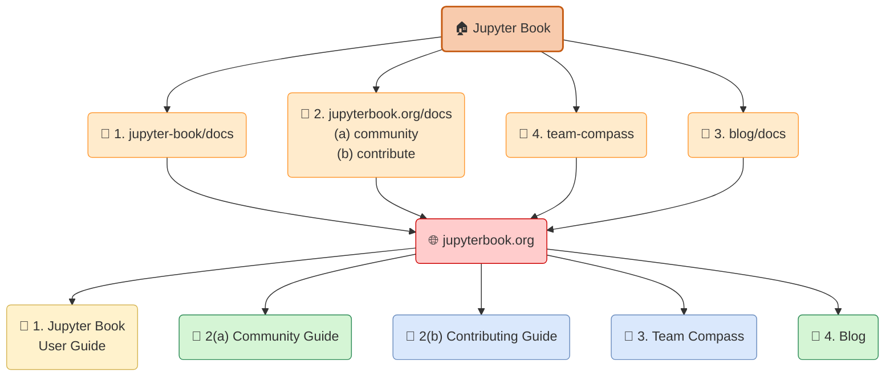
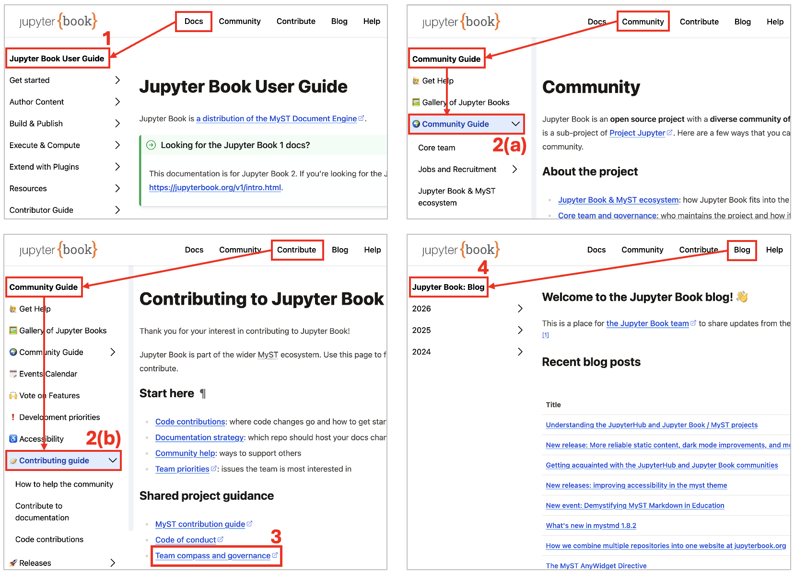
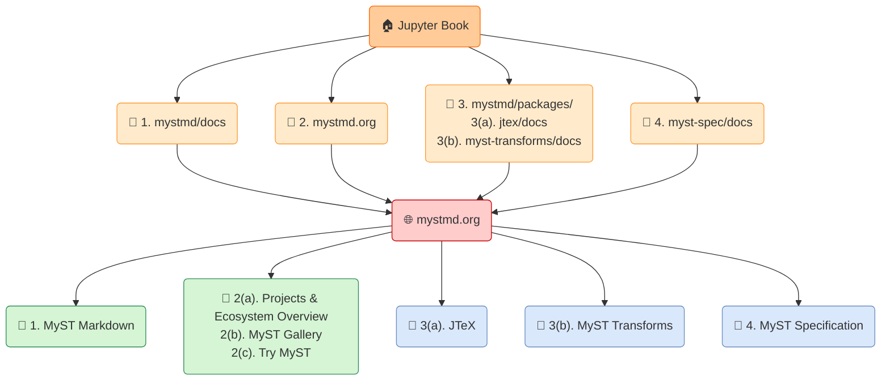
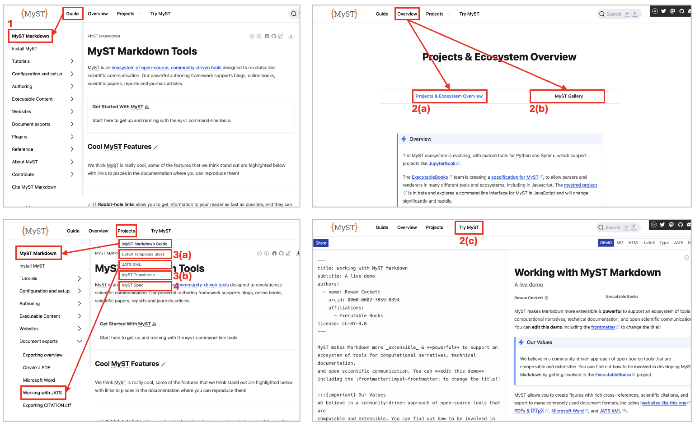

This month, I share some of the work I have been doing to better understand the  Jupyter Book/MyST documentation, where it is hosted on GitHub, and how it can be accessed through the projects' websites. 
I also report on a few other areas of work, such as joining the Jupyter Community Building Working Group and starting prepare three events that will take place this fall.


## GitHub repositories and websites hosting Jupyter Book/MyST documentation

There are several repositories in the [`Jupyter Book GitHub organization`](https://github.com/jupyter-book) whose content converges into the two websites [jupyterbook.org](https://jupyterbook.org/) and [mystmd.org](https://mystmd.org/). 
(I talked about the differences between Jupyter Book and MyST in my [previous post](./02-cm-understanding-projects.md)). 

For an overview of the content of each website and where it is located, I created a [Mermaid](https://mermaid.ai/open-source/intro/) diagram showing how the GitHub repositories map to the different sections of the websites and highlighting the intended audience.
I also created figures illustrating how these sections can be accessed through the websites' navigation.
Here they are!


### Repositories and content for [jupyterbook.org](https://jupyterbook.org/)

The documentation published on [jupyterbook.org](https://jupyterbook.org/) is distributed across four **repositories**, each corresponding to a **different section of the website**.  


```mermaid
flowchart LR;
    
    subgraph container [" "]
        direction LR
        legend("**Legend:**")
        gh_org("🏠 GitHub organization")
        gh_repo("📁 GitHub repository")
        website("🌐 Website")
        website_sec("📄 Website section")
    end

    legend~~~ gh_org ~~~ gh_repo ~~~ website ~~~ website_sec
    
    classDef transparent_title fill:none,stroke:none
        class container transparent_title
    classDef transparent_block_large_font fill:#ffffff,stroke:none,font-size: 14px
        class legend, transparent_block_large_font
    classDef transparent_block fill:#ffffff,stroke:none,font-size: 12px
        class ,gh_org,gh_repo,website,website_sec transparent_block
```




*Diagram 1: GitHub repositories and corresponding sections in jupyterbook.org.
First layer (top): Jupyter Book GitHub organization (orange). 
Second layer: GitHub repositories containing documentation (light orange). 
Third layer: The website where the content is hosted (red). 
Fourth layer: Sections of the website (yellow: content for users; green: content for users and developers; blue: content for developers). 
The numbers correspond to the repositories in the second layer.*

 

*Figure 1: Access to sections in jupyterbook.org.
Top left: Access to the Jupyter Book User Guide from the navigation bar.
Top right: Access to the Commuity Guide, which is part of the broader Community Guide.
Bottom left: Access to the Contributing Guide, which is also part of the broader Community Guide.
Within the Contributing Guide, the Team Compass can be accessed by clicking on Team Compass and Governance. 
Bottom right: Access to the Jupyter Blog.
The numbers correspond to the GitHub repositories in the diagram above.*

As it can be deduced by the diagram and figure above, GitHub repositories, website sections, and their access from the navigation bar are related as follows:

- [`jupyter-book/docs`](https://github.com/jupyter-book/jupyter-book/tree/main/docs) contains the documentation that is rendered in [Jupyter Book User Guide](https://jupyterbook.org/stable), which can be accessed on the website by clicking *Docs* in the navigation bar. 
- [`jupyterbook.org/docs/`](https://github.com/jupyter-book/jupyterbook.org/tree/main/docs/) contains the website's community and contribution documentation.
Specifically, the content in [`docs/community`](https://github.com/jupyter-book/jupyterbook.org/tree/main/docs/community) is rendered in the [Community Guide](https://jupyterbook.org/community/), which can be accessed by clicking *Community* in the navigation bar.
The documentation in [`docs/contribute`](https://github.com/jupyter-book/jupyterbook.org/tree/main/docs/contribute) is rendered in the [Contributing Guide](https://jupyterbook.org/contribute/), which can be accessed by clicking *Contribute* in the navigation bar.
- [`team-compass`](https://github.com/jupyter-book/team-compass) contains [The Jupyter Book Team Compass](https://jupyterbook.org/compass/) and can be accessed from *Team compass and governance* in the main page of the [Contributing Guide](https://jupyterbook.org/contribute/)
- [`blog/docs`](https://github.com/jupyter-book/blog/tree/main/docs) contains the content of the [Jupyter Book Blog](https://jupyterbook.org/blog), which can be accessed by clicking *Blog* in the navigation bar.

To learn more about **how content from different repositories comes together on a single website**, have a look at [Chris Holdgraf](https://chrisholdgraf.com/)'s blog post [How we combine multiple repositories into one website at jupyterbook.org](./multi-repo.md)


### Repositories and content for [mystmd.org](https://mystmd.org/)

The documentation available on [mystmd.org](https://mystmd.org/) is spread across four **repositories**, each contributing content to a **specific section of the website**.

```mermaid
flowchart LR;
    
    subgraph container [" "]
        direction LR
        legend("**Legend:**")
        gh_org("🏠 GitHub organization")
        gh_repo("📁 GitHub repository")
        website("🌐 Website")
        website_sec("📄 Website section")
    end

    legend~~~ gh_org ~~~ gh_repo ~~~ website ~~~ website_sec
    
    classDef transparent_title fill:none,stroke:none
        class container transparent_title
    classDef transparent_block_large_font fill:#ffffff,stroke:none,font-size: 14px
        class legend, transparent_block_large_font
    classDef transparent_block fill:#ffffff,stroke:none,font-size: 12px
        class ,gh_org,gh_repo,website,website_sec transparent_block
```



*Figure: 
First layer (top): Jupyter Book GitHub organization (orange). 
Second layer: GitHub repositories containing documentation (light orange).
Third layer: The website where the content is hosted (red). 
Fourth layer: Sections of the website (green: content for users and developers; blue: content for developers). The numbers correspond to the repositories in the second layer.*



*Figure 1: Access to sections in mystmd.org.
Top left: Access to the MyST Markdown guide from the navigation bar.
Top right: Access to the Projects & Ecosystem Overview and MyST Gallery.
Bottom left: Access to the MyST Markdown guide, Latex Templates, JATS XML, MyST Transforms, and MyST Spec from the drop-down menu Projects in the navigation bar.
Bottom right: Access to Try MyST.
The numbers correspond to the GitHub repositories in the diagram above.*

GitHub repositories, website sections, and their access points in the navigation bar are related as follows:

- [`mystmd/docs`](https://github.com/jupyter-book/mystmd/tree/main/docs) contains the documentation that is rendered in [MyST Markdown](https://mystmd.org/guide), which can be accessed on the website by clicking *Guide* in the navigation bar. 
- [`mystmd.org`](https://github.com/jupyter-book/mystmd.org) contains the website's landing page, as well as and the pages [Projects & Ecosystem Overview](https://mystmd.org/overview/ecosystem) and [MyST Gallery](https://mystmd.org/overview/gallery), which can be accessed by clicking *Overview* in the navigation bar. It also contains the [Try MyST](https://mystmd.org/sandbox) tool.
- Within [`mystmd/packages`](https://github.com/jupyter-book/mystmd/tree/main/packages/),
[`jtex/doc`](https://github.com/jupyter-book/mystmd/tree/main/packages/jtex/docs) contains the [JTEX](https://mystmd.org/jtex) documentation,
while [`myst-transforms`](https://github.com/jupyter-book/mystmd/tree/main/packages/myst-transforms) contains the [MyST Transforms](https://mystmd.org/myst-transforms) documentation. 
Both can be accessed from the *Project* drop-down menu in the navigation bar.
- [`myst-spec/docs`](https://github.com/jupyter-book/myst-spec) contains the documentation that is rendered in [MyST Specification](https://mystmd.org/spec)


### Some considerations
The two websites [jupyterbook.org](https://jupyterbook.org/) and [mystmd.org](https://mystmd.org/) **provide extensive resources** for users, contributors, and maintainers. 

On [jupyterbook.org](https://jupyterbook.org/), one can find **guides for users**, as well as **resources about the Jupyter/MyST Community**, including the community guide, information on how to contribute, and the blog.

On [mystmd.org](https://mystmd.org/), the focus in more on **technical content**, with documentation for advanced users and information for for developers. 

Looking ahead, we might want to make some parts of the documentation **easier to find**, improve the **onboarding experience** for both users and contributors, and make the **relationship between the two websites clearer** while reducing the overlap between them.


## Joining the Jupyter Community Building Working Group

The [Jupyter Community Building (JBC) Working Group](https://jupyter.org/governance/communitybuildingworkinggroup/) is one of the four working groups or committees of Project Jupyter — the other three are the [Jupyter Media Strategy Working Group](https://jupyter.org/governance/charters/mediastrategycharter/), the [Documentation Working Group Charter](https://jupyter.org/governance/charters/documentationcharter/), and the [Diversity Equity and Inclusion Committee Charter](https://jupyter.org/governance/charters/deicharter/). 
The **objective** of the JBC is to **build, grow, and connect the Jupyter community of developers and users**, with the final outcome to **improve diversity, equity and inclusion** within the community. 
The [areas of responsability](https://jupyter.org/governance/communitybuildingworkinggroup/#areas-of-responsibility) include managing and supporting Jupyter Community Workshops, Operations and Budget, and Diversity, Equity, and Inclusion. 

I joined the JBC with a lot of enthusiasm, and I was very happy to have my membership unanimously approved by [its members](https://jupyter.org/governance/people/#jupyter-community-building-working-group). 
We meet once a week for 30-45 minutes, and I have been really impressed by **how much we can accomplish in these short, fast-paced meetings**. 
Over the past few weeks, we have mainly been working on a proposal to request funding for Jupyter Community Workshop in late 2026 and 2027. 
Finger crossed that we get the funding! 


## Preparing events for the coming months 
This month I have also started working on three events that will take place in the coming months: 
- [**Jupyter mini summit**](https://events.linuxfoundation.org/open-source-summit-europe/features/co-located-events/#jupyter-mini-summit) at Open Source Summit Europe, 6 October 2026, Prague.
It will be a morning event where we will **bring together contributors, users, and community members to connect, collaborate, and share ideas**.
I will chair the event, and I contributed to the definition of the schedule.
I will also give a presentation where I will talk about my work as a JupyterHub and Jupyter Book community manager.
- [**Compute!**](https://compute.events/paris2026/), 25-26 November 2026, Paris.
It is a new conference for people working with **open source computation and data**.
There too, I will present my work as a JupyterHub and Jupyter Book community manager.
In addition, we are also organizing some events specific for the Jupyter community. Stay tuned!
- **2{sup}`nd` HubDash**, 30 November-1 December 2026, online.
In the JupyterHub Community, we are thinking about [organizing the 2{sup}`nd` HubDash](https://github.com/jupyterhub/team-compass/issues/926), in parallel with the Turing Way Book Dash, following the success of the [first edition last year](https://github.com/jupyterhub/team-compass/issues/811).
A HubDash is a two-day sprint where participants work collaboratively and synchronously on a specific topic. This year, the topic could be **creating a collection of use cases of JupyterHub deployments**.
We are also considering using the time at the [Collaboration Cafes](https://compass.hub.jupyter.org/meetings/collab-cafe/) over the coming months to prepare material for that event.
As we are still discussing the details, the plans may change.
More details to come in one of the next posts!

_And that's it for this month! See you next month!_